# Projet Terraform AWS

Infrastructure AWS provisionnée avec Terraform et intégrée à un pipeline CI/CD GitHub Actions.

## Objectif du projet

Ce projet a pour but d'automatiser le déploiement d'une infrastructure AWS simple, reproductible et sécurisée à l'aide d'Infrastructure as Code.

L'infrastructure créée comprend :

- un VPC dédié ;
- un sous-réseau public ;
- une Internet Gateway ;
- une table de routage publique ;
- un Security Group ouvrant les ports `22` et `80` ;
- une instance EC2 Ubuntu avec Nginx installé automatiquement au démarrage.

Le tout est géré par Terraform avec un stockage distant du state dans S3 et un verrouillage via DynamoDB.

## Problématique

Avant ce projet, le déploiement d'une infrastructure cloud pouvait être :

- long à reproduire manuellement ;
- sujet aux erreurs de configuration ;
- difficile à versionner et à relire ;
- peu sécurisé si les contrôles qualité ne sont pas automatisés.

La problématique adressée est donc la suivante :

**Comment déployer une infrastructure AWS de manière reproductible, contrôlée et automatisée, tout en ajoutant des vérifications de sécurité et de qualité avant la mise en production ?**

## Solution mise en place

La réponse apportée par ce projet repose sur deux piliers :

1. **Terraform** pour décrire et provisionner l'infrastructure de façon déclarative.
2. **GitHub Actions** pour automatiser les contrôles, le déploiement et la destruction de l'environnement.

## Architecture du projet

Cette architecture illustre la logique DevSecOps et GitOps du projet.
Elle montre le chemin complet entre le développeur, la chaîne de validation, le déploiement Terraform et l'accès final à l'infrastructure AWS.

<p align="center">
  
  
  
  
</p>



```mermaid
flowchart LR
    Dev[👨‍💻 Développeur] -->|Push / Pull Request| GH[🐙 GitHub Repository]
    GH --> CI0[🔄 CI Gate]

    subgraph CI["CI : code & quality gate"]
        direction TB
        CI0 --> CI1[📥 Checkout]
        CI1 --> CI2[🔍 TruffleHog]
        CI2 --> CI3[🧪 TFLint]
        CI3 --> CI4[🛡️ Trivy IaC scan]
    end

    CI4 --> CD0[🚀 CD Gate]

    subgraph CD["CD : infrastructure deployment"]
        direction TB
        CD0 --> CD1[🔑 Terraform Init]
        CD1 --> CD2[🪣 S3 backend + DynamoDB lock]
        CD2 --> CD3[⚙️ Terraform Apply / Destroy]
        CD3 --> CD4[☁️ AWS API]
    end

    CD4 --> AWS0

    subgraph AWS["AWS target environment"]
        direction LR
        AWS0[🌐 VPC] --> AWS1[📶 Subnet public] --> AWS2[🔒 Security Group] --> AWS3[🖥️ EC2 Ubuntu + Nginx]
    end

    AWS3 --> User[👥 Utilisateur final]
    CD3 --> Mail[📧 Notification email]

    classDef ciStyle fill:#1f2937,stroke:#3b82f6,stroke-width:2px,color:#fff;
    classDef cdStyle fill:#111827,stroke:#10b981,stroke-width:2px,color:#fff;
    classDef awsStyle fill:#232f3e,stroke:#ff9900,stroke-width:2px,color:#fff;
    classDef devStyle fill:#4b5563,stroke:#9ca3af,stroke-width:1px,color:#fff;
    classDef mailStyle fill:#d92727,stroke:#b91c1c,stroke-width:2px,color:#fff;

    class Dev,User devStyle;
    class CI0,CI1,CI2,CI3,CI4 ciStyle;
    class CD0,CD1,CD2,CD3,CD4 cdStyle;
    class AWS0,AWS1,AWS2,AWS3 awsStyle;
    class Mail mailStyle;
```

En pratique :

- la CI filtre les risques avant tout déploiement ;
- la CD applique ou détruit l'infrastructure de manière contrôlée ;
- le backend S3 et le verrouillage DynamoDB sécurisent le state Terraform ;
- la notification email permet de suivre l'état du pipeline sans ouvrir GitHub Actions.

## Arborescence

- [`main.tf`](./main.tf) : ressource principale et instance EC2.
- [`vpc.tf`](./vpc.tf) : réseau VPC.
- [`subnet.tf`](./subnet.tf) : sous-réseau public.
- [`security_group.tf`](./security_group.tf) : règles réseau.
- [`ec2.tf`](./ec2.tf) : machine virtuelle.
- [`providers.tf`](./providers.tf) : configuration du provider AWS et du backend.
- [`variables.tf`](./variables.tf) : variables d'entrée.
- [`outputs.tf`](./outputs.tf) : valeurs exposées après exécution.
- [`.github/workflows/terraform-apply.yml`](./.github/workflows/terraform-apply.yml) : pipeline de vérification et de déploiement.
- [`.github/workflows/terraform-destroy.yml`](./.github/workflows/terraform-destroy.yml) : pipeline manuel de destruction.

## Pré-requis

Avant de lancer le projet localement, il faut disposer de :

- Terraform `>= 1.5.0` ;
- un compte AWS ;
- des identifiants AWS configurés localement ou dans GitHub Secrets ;
- un bucket S3 déjà créé pour le backend Terraform ;
- une table DynamoDB déjà créée pour le verrouillage du state ;
- GitHub Actions configuré avec les secrets `AWS_ACCESS_KEY_ID` et `AWS_SECRET_ACCESS_KEY` ;
- si tu utilises la notification email, les secrets `MAIL_USERNAME`, `MAIL_PASSWORD` et `NOTIFICATION_EMAIL`.

Configuration utilisée dans ce projet :

- région AWS : `eu-west-3` ;
- type d'instance par défaut : `t3.micro` ;
- AMI : Ubuntu 22.04 LTS récente récupérée dynamiquement.

## Lancer le projet en local

### 1. Initialiser Terraform

```bash
terraform init
```

### 2. Vérifier le formatage

```bash
terraform fmt -check
```

### 3. Voir le plan d'exécution

```bash
terraform plan
```

### 4. Appliquer l'infrastructure

```bash
terraform apply
```

Confirme ensuite avec `yes`.

### 5. Récupérer les sorties

Après l'application, Terraform affiche :

- l'IP publique de l'instance EC2 ;
- l'ID du VPC créé.

## Lancer les jobs du pipeline

Le dépôt contient deux workflows GitHub Actions.

### 1. Workflow de déploiement : `terraform-apply.yml`

Ce workflow est déclenché sur les pull requests vers `main`.

Il exécute deux jobs :

- `terraform-checks` : contrôle qualité et sécurité ;
- `terraform-deploy` : initialisation Terraform, vérification du format et `terraform apply`.

#### Lancer ce pipeline

1. Ouvre une pull request vers la branche `main`.
2. GitHub Actions lance automatiquement les contrôles.
3. Si les vérifications passent, le job de déploiement s'exécute.

#### Détail des vérifications

Le job `terraform-checks` exécute :

- `trufflehog` pour détecter d'éventuelles fuites de secrets ;
- `tflint` pour analyser les bonnes pratiques Terraform ;
- `trivy` pour scanner la configuration IaC.

Le job `terraform-deploy` exécute :

- `terraform init -reconfigure` ;
- `terraform fmt -check` ;
- `terraform apply -auto-approve`.

### Notification email de fin de pipeline

Le workflow de déploiement contient aussi un job de notification email qui s'exécute après les étapes principales.

Ce job permet d'envoyer un message automatique en cas de :

- succès du pipeline ;
- échec du pipeline.

Il s'appuie sur le step `dawidd6/action-send-mail@v3` et utilise les secrets GitHub suivants :

- `MAIL_USERNAME` ;
- `MAIL_PASSWORD` ;
- `NOTIFICATION_EMAIL`.

L'objectif est de garder une trace claire de l'état final du pipeline sans devoir consulter manuellement GitHub Actions à chaque exécution.

### 2. Workflow de destruction : `terraform-destroy.yml`

Ce workflow est manuel et se lance via `workflow_dispatch`.

Il est composé de deux jobs :

- `security-and-quality-checks` : mêmes contrôles de sécurité et qualité ;
- `terraform-destroy` : destruction de l'infrastructure.

#### Lancer ce pipeline

1. Va dans l'onglet **Actions** du dépôt GitHub.
2. Sélectionne le workflow **AWS Terraform - Destruction Manuelle**.
3. Clique sur **Run workflow**.

Ce workflow exécute d'abord les contrôles, puis lance :

```bash
terraform destroy -auto-approve
```

Le workflow de destruction peut lui aussi intégrer un job de notification email afin d'indiquer si la destruction s'est terminée correctement ou non.

## Ce que j'ai appris grâce à ce projet

Ce projet m'a permis d'apprendre plusieurs points importants :

- structurer une infrastructure AWS de manière déclarative ;
- utiliser un backend distant S3 pour sécuriser et partager le state Terraform ;
- mettre en place un verrouillage avec DynamoDB pour éviter les conflits ;
- automatiser des contrôles qualité avec TFLint, Trivy et Trufflehog ;
- comprendre le fonctionnement d'un pipeline CI/CD appliqué à l'IaC ;
- mieux gérer le cycle de vie complet d'une infrastructure, de la création à la destruction ;
- écrire des ressources Terraform plus lisibles grâce à une séparation en fichiers ;
- réfléchir à la sécurité dès la phase de déploiement.

## Résultat obtenu

À la fin du déploiement, le projet fournit :

- une infrastructure réseau AWS fonctionnelle ;
- une instance EC2 accessible publiquement ;
- un serveur Nginx démarré automatiquement ;
- un point d'entrée simple pour tester un déploiement automatisé de bout en bout.

---

## Licence

Ce projet est sous licence **MIT** — voir le fichier [LICENSE](LICENSE) pour plus de détails.
